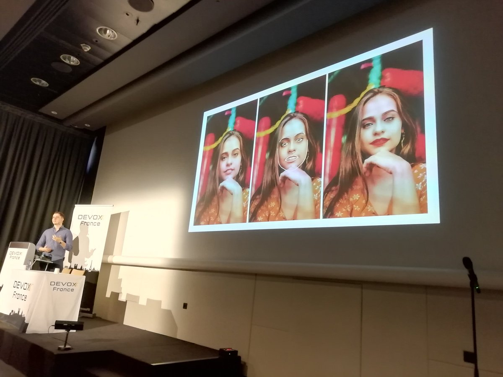
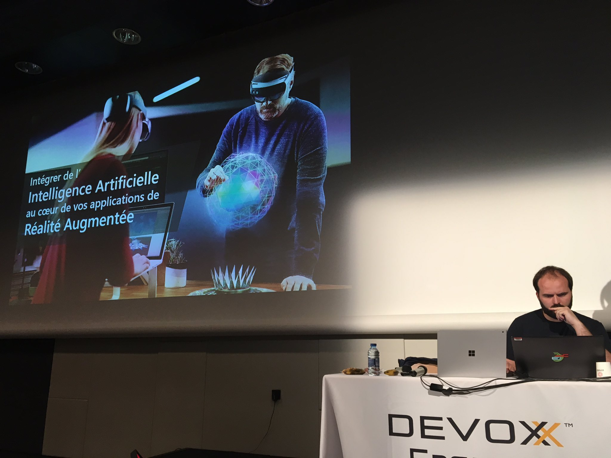
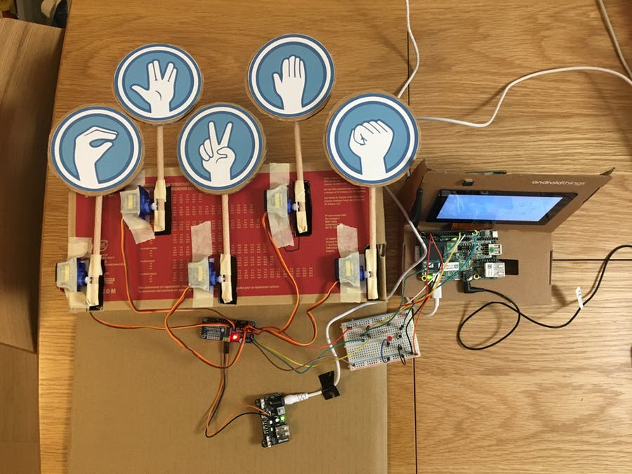

= confs `IA` 🤖 de Devoxx France 2019
:icons: font
:asset-uri-scheme: https
:source-highlighter: highlightjs
:deckjs_theme: swiss
:deckjs_transition: fade
:navigation: false
:goto: true
:status: true
:toc:

image::images/devoxx.png[float="right"]

== Université - Deep Learning pour le traitement du Langage avec Pytorch

|=======================
a|video::zh3y7BMjlS4[youtube] 
image::images/youtube.PNG[] 
https://www.youtube.com/watch?v=zh3y7BMjlS4&list=PLTbQvx84FrASreUHVwlEk5AUGozY5g2tn&index=9[video]  a|
image::images/cfp.PNG[cfp,25,35] 
https://cfp.devoxx.fr/2019/talk/MWS-2869/Deep_Learning_pour_le_traitement_du_Langage_avec_Pytorch[description du talk]

image::images/github.PNG[] 
https://github.com/sebastien-collet/talks/tree/master/DevoxxFR%20-%2017-04-2019[repo github]

image::images/slide.PNG[] 
https://docs.google.com/presentation/d/11IVhfjzB9uSnTxpJ5ot0G_OXjkK13wri8AXEg5PQU8U/edit#slide=id.g57eac4a3b9_2_121[slides]

|=======================

== Tools-in-Action - Deep-learning et reconnaissance d’image: des viennoiseries dans mon JS ?

|=======================
a|video::s5bsNn-AzMY[youtube] 
image::images/youtube.PNG[] 
https://www.youtube.com/watch?v=s5bsNn-AzMY&list=PLTbQvx84FrASoQ3S-Ci8OhHzLyMuLy0Wl&index=4[video]  a|
image::images/cfp.PNG[cfp,25,35] 
https://cfp.devoxx.fr/2019/talk/GXQ-8625/Deep-learning_et_reconnaissance_d%E2%80%99image:_des_viennoiseries_dans_mon_JS_%3F[description du talk]

image::images/github.PNG[] 
https://github.com/PPACI/Devoxx19-TensorflowJS[repo github]

image::images/slide.PNG[] 
https://www.slideshare.net/pierrepaci/devoxx-19-du-deeplearning-dans-mon-js[slides]

|=======================

== Tools-in-Action - Deep Learning sur la JVM : DL4J

|=======================
a|video::QfnCcPcZogI[youtube] 
image::images/youtube.PNG[] 
https://www.youtube.com/watch?v=QfnCcPcZogI&list=PLTbQvx84FrASoQ3S-Ci8OhHzLyMuLy0Wl&index=14[video]  a|
image::images/cfp.PNG[cfp,25,35]  
https://cfp.devoxx.fr/2019/talk/OCB-5151/Deep_Learning_sur_la_JVM_:_DL4J[description du talk]

image::images/github.PNG[] 
https://github.com/arnauddelaunay/deep-learning-with-dl4j[repo github] a| 
image::images/dl4j-demo.gif[]

|=======================

== Tools-in-Action - TensorFlow 1.x n'est plus, Vive TensorFlow 2.0

|=======================
a|video::8yHVPR4thCE[youtube] 
image::images/youtube.PNG[] 
https://www.youtube.com/watch?v=8yHVPR4thCE&list=PLTbQvx84FrASoQ3S-Ci8OhHzLyMuLy0Wl&index=6[video]  a|
image::images/cfp.PNG[cfp,25,35]  
https://cfp.devoxx.fr/2019/talk/RJH-6412/TensorFlow_1.x_n'est_plus,_Vive_TensorFlow_2.0[description du talk]

image::images/slide.PNG[] 
https://fr.slideshare.net/AlexiaAudevart/tensorflow-v2[slides]

|=======================

== Conference - Introduction to Face Processing with Computer Vision

|=======================
a|video::JVfE2rbo0ZY[youtube] 
image::images/youtube.PNG[] 
https://www.youtube.com/watch?v=JVfE2rbo0ZY&list=PLTbQvx84FrAQq7IvYawPgISFBjQqJUA5O[video]  a|
image::images/cfp.PNG[cfp,25,35] 
https://cfp.devoxx.fr/2019/talk/LQO-4838/Introduction_to_Face_Processing_with_Computer_Vision[description du talk]

image::images/slide.PNG[] 
https://www.gabrielbianconi.com/articles/introduction-to-face-processing-with-computer-vision/[slides] a| 

|=======================

== Conference - L'Intelligence Artificielle pour tous

|=======================
a|video::-H1T9ksSKhA[youtube] 
image::images/youtube.PNG[] 
https://www.youtube.com/watch?v=-H1T9ksSKhA&list=PLTbQvx84FrAQQNKqULfgMDq9eL-V4pclW&index=94[video]  a|
image::images/cfp.PNG[cfp,25,35] 
https://cfp.devoxx.fr/2019/talk/CDR-2582/L'Intelligence_Artificielle_pour_tous[description du talk]

image::images/github.PNG[] 
https://github.com/rachel-orti/ai4all[repo github]

image::images/slide.PNG[] 
https://github.com/rachel-orti/ai4all/blob/master/IA_pour_tous.pdf[slides]

|=======================

== Hands-on Labs - Manipulation des APIs haut niveau de TensorFlow

|=======================
a|  a|
image::images/cfp.PNG[cfp,25,35] 
https://cfp.devoxx.fr/2019/talk/IRH-5400/Manipulation_des_APIs_haut_niveau_de_TensorFlow[description du talk]

image::images/github.PNG[] 
https://github.com/xebia-france/hands_on_tensorflow_high_level_apis[repo github]

image::images/slide.PNG[] 
https://github.com/xebia-france/hands_on_tensorflow_high_level_apis/blob/master/Devoxx%20-%20Hands-On%20-%20APIs%20haut%20niveau%20de%20TensorFlow%20-%20VF.pdf[slides]

|=======================

== Quickie - Mes premiers pas en deeplearning avec Keras

|=======================
a|video::fSCT2Jv4mDU[youtube] 
image::images/youtube.PNG[] 
https://www.youtube.com/watch?v=fSCT2Jv4mDU&list=PLTbQvx84FrASeXa4a5FhDr0F3NdEPhvpS&index=10[video]  a|
image::images/cfp.PNG[cfp,25,35] 
https://cfp.devoxx.fr/2019/talk/ZXL-4420/Mes_premiers_pas_en_deeplearning_avec_Keras[description du talk]

|=======================

== Conference - Traitement Automatique du Langage sur du texte en 2019

|=======================
a|video::pOfk7UbUIRI[youtube] 
image::images/youtube.PNG[] 
https://www.youtube.com/watch?v=pOfk7UbUIRI&list=PLTbQvx84FrAQQNKqULfgMDq9eL-V4pclW&index=68[video]  a|
image::images/cfp.PNG[cfp,25,35] 
https://cfp.devoxx.fr/2019/talk/CEM-7474/Traitement_Automatique_du_Langage_sur_du_texte_en_2019[description du talk]

|=======================

== Conference - Le Deep Learning par la pratique: Extraire des informations de commit

|=======================
a|video::1zr8TBZ4JjI[youtube] 
image::images/youtube.PNG[] 
https://www.youtube.com/watch?v=1zr8TBZ4JjI&list=PLTbQvx84FrAQQNKqULfgMDq9eL-V4pclW&index=54[video]  a|
image::images/cfp.PNG[cfp,25,35] 
https://cfp.devoxx.fr/2019/talk/NIJ-7963/Le_Deep_Learning_par_la_pratique:_Extraire_des_informations_de_commit[description du talk]

|=======================

== Conference - Intégrer de l'Intelligence Artificielle au cœur de vos applications de réalité augmentée

|=======================
a|video::prmnSatLZ7Q[youtube] 
image::images/youtube.PNG[] 
https://www.youtube.com/watch?v=prmnSatLZ7Q&list=PLTbQvx84FrAQQNKqULfgMDq9eL-V4pclW&index=35[video]  a|
image::images/cfp.PNG[cfp,25,35] 
https://cfp.devoxx.fr/2019/talk/TRR-3304/Integrer%C2%A0de%C2%A0l'Intelligence%C2%A0Artificielle_au_c%C5%93ur%C2%A0de%C2%A0vos_applications_de_realite_augmentee[description du talk]

image::images/github.PNG[] 
https://danvy.tv/mixed-reality-artificial-intelligence-devoxx-2019/[repo github]

image::images/slide.PNG[] 
https://www.slideshare.net/danvy/mixed-reality-artificial-intelligence-with-hololens-at-devoxx-2019/[slides] a| 

|=======================

== Conference - Le Deep Learning peut sauver votre entreprise !

|=======================
a|video::kvz6mtV_WRQ[youtube] 
image::images/youtube.PNG[] 
https://www.youtube.com/watch?v=kvz6mtV_WRQ&list=PLTbQvx84FrAQQNKqULfgMDq9eL-V4pclW&index=36[video]  a|
image::images/cfp.PNG[cfp,25,35] 
https://cfp.devoxx.fr/2019/talk/UDB-2717/Le_Deep_Learning_peut_sauver_votre_entreprise_![description du talk]

|=======================

== Stand - Rock-Paper-Scissors-Spock-Lizard Hand Game Robot

|=======================
a|  a|
image::images/cfp.PNG[cfp,25,35] 
https://www.hackster.io/bonbonking/rock-paper-scissors-spock-lizard-hand-game-robot-663302[description du talk]

image::images/github.PNG[] 
https://github.com/jinqian/at-rock-paper-scissors-lizard-spock[repo github]

image::images/slide.PNG[] 
https://speakerdeck.com/jinqian/play-rock-paper-scissors-spock-lizard-with-your-android-things[slides] a| 

|=======================

